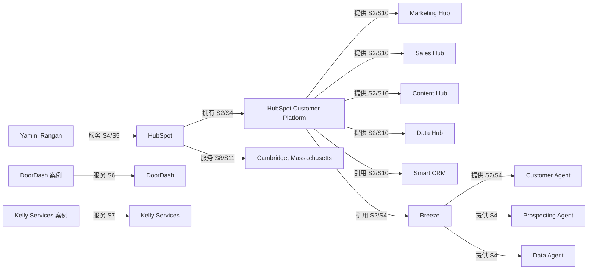

<!--
Copyright © 2026 姚金刚. All rights reserved.
Project: yao-geo-brand-graph
Created by: 姚金刚
Date: 2026-05-16
X: https://x.com/yaojingang
-->

# HubSpot 品牌实体知识图谱测试报告（国内 AI 平台场景）

- 品牌：HubSpot
- 范围：以 HubSpot 官方资料、投资者关系披露和官方客户案例为来源，测试品牌实体图谱在 DeepSeek、豆包、千问、Kimi、腾讯元宝等国内 AI 平台问答场景中的消歧、证据和结构化输出能力。
- 报告日期：2026-05-21

## 执行摘要

- HubSpot 的核心规范实体应从早期“入站营销软件”升级为“AI-powered / agentic customer platform”，并保留 Marketing Hub、Sales Hub、Service Hub、Content Hub、Data Hub、Commerce Hub、Smart CRM、Breeze 等产品和技术别名。
- 国内 AI 平台容易把 HubSpot 简化为营销自动化工具，或把 Content Hub/Data Hub 与旧产品名混淆；测试场景应覆盖品牌定义、产品线、人物地点、客户案例和 AI 能力五类问题。
- 关系图谱必须区分官方事实、投资者关系披露、官方客户案例、媒体描述和推断，避免把 Q1 2026 客户数、案例效果和 AI Agent 能力写成无日期、无来源的泛化断言。

## 权威参考与适用边界

| 参考 | 权威来源 | 适用边界 | 落地规则 | 链接 |
| --- | --- | --- | --- | --- |
| RDF 1.1 Concepts | W3C Recommendation | 把品牌事实统一表达为 subject-predicate-object，并保留方向。 | 关系清单和三元组样例必须能互相映射；复杂关系要拆成多条可审计关系。 | https://www.w3.org/TR/rdf-concepts/ |
| JSON-LD 1.1 | W3C Recommendation | 将可验证品牌实体事实序列化为网页可嵌入的 Linked Data。 | JSON-LD 建议只承载页面正文已写明的品牌、产品、人物和组织事实。 | https://www.w3.org/TR/json-ld11/ |
| PROV-O | W3C Recommendation | 记录来源、生成过程、证据和事实主张之间的可追溯关系。 | 每条核心关系必须绑定来源 ID、来源类型、日期、核验状态和使用方式。 | https://www.w3.org/TR/prov-o/ |
| SHACL | W3C Recommendation | 用 shapes 思路约束图谱字段完整性和质量门。 | 质量报告必须检查实体类型覆盖、证据 ID、输出文件、Word 表宽和 HTML 防溢出。 | https://www.w3.org/TR/shacl/ |
| SKOS | W3C Recommendation | 管理品牌简称、英文名、旧名、产品别名、行业词和易混词。 | 消歧表必须把规范实体、别名、易混项、处理决策和依据分开。 | https://www.w3.org/2004/02/skos/specs |
| Schema.org Organization / SoftwareApplication | Schema.org vocabulary | 选择 Organization、Person、Offer、SoftwareApplication 等结构化数据对象。 | Schema 对象必须和页面正文以及来源账本一致，不能替代缺失正文。 | https://schema.org/Organization |
| Google Search structured data guidelines | Google Search Central | 约束结构化数据和网页可见内容的一致性。 | 页面没展示的事实不进入 JSON-LD；页面展示但无证据的事实列为待确认。 | https://developers.google.com/search/docs/appearance/structured-data/intro-structured-data |
| Knowledge Graphs | ACM Computing Surveys / arXiv | 用 schema、identity、context、quality assessment 组织知识图谱方法。 | 报告必须覆盖身份消歧、上下文、质量评估、发布和维护闭环。 | https://arxiv.org/abs/2003.02320 |
| Entity Linking with a Knowledge Base | IEEE TKDE | 用 mention、candidate、canonical entity 的流程处理简称和歧义。 | 对 HubSpot、HubSpot CRM、Customer Platform、Content Hub、Data Hub 等易混名称必须给出消歧规则。 | https://doi.org/10.1109/TKDE.2014.2327028 |

## 系统分析维度矩阵

| 维度 | 检查问题 | 当前结论 | 风险 | 补强动作 |
| --- | --- | --- | --- | --- |
| 品牌定义 | HubSpot 当前应被定义为什么，而不是停留在哪个旧标签？ | 以 2026 Q1 投资者关系披露和官网产品页为准，应定义为 agentic / AI-powered customer platform。 | 国内平台可能仍回答为入站营销软件或单一营销自动化工具。 | 中文百科页首段固定写明客户平台、Smart CRM、六个 Hub 和 Breeze。 |
| 产品体系 | 主要产品线、CRM、AI 能力和服务收入类别是否被拆开？ | Marketing Hub、Sales Hub、Service Hub、Content Hub、Data Hub、Commerce Hub、Smart CRM、Breeze 已独立建点。 | Data Hub 与 Smart CRM、Content Hub 与 CMS Hub 易混。 | FAQ 增加产品边界、旧名和别名的专门消歧。 |
| 人物地点 | CEO、联合创始人、总部和办公地点是否有来源日期？ | Yamini Rangan、Brian Halligan、Dharmesh Shah、Cambridge 总部已有来源账本。 | Brian Halligan 容易被过期资料误写成现任 CEO。 | 人物关系在页面中加“截至披露日期”的时间限定。 |
| 客户案例 | 案例指标是否只引用官方公开结果？ | DoorDash 和 Kelly Services 案例均来自 HubSpot 官方客户案例页。 | AI 回答可能把案例指标外推为普遍承诺。 | 在案例页和知识库中标注“个案结果，不代表所有客户”。 |
| 关系证据 | 每条拥有、提供、引用、服务、来源和时间关系是否有证据 ID？ | 核心关系均绑定 S2、S4、S6、S7、S10 等来源。 | 新增关系若无来源会降低监测纠偏可审计性。 | 新增关系默认进入待确认，补证后再进三元组。 |
| 时间版本 | 客户数、AI Agent、产品命名是否有时间戳？ | Q1 2026 客户数和 AI Agent 信息已绑定 2026-05-07 披露。 | 后续季度更新后旧数字可能被继续引用。 | 监测计划中加入季度财报刷新和产品页刷新。 |
| Schema 一致性 | JSON-LD 是否只写页面正文能支撑的事实？ | Organization、Person、Offer、SoftwareApplication 可进入建议，但案例效果和客户数需页面正文同步展示后再写。 | 结构化数据比正文更“丰富”会造成搜索质量风险。 | 发布前用页面正文逐项核对 JSON-LD 字段。 |
| 国内 AI 平台适配 | DeepSeek、豆包、千问、Kimi、腾讯元宝的检索生成问题是否覆盖关键歧义？ | 已覆盖品牌定义、产品线、人物地点、客户案例和 AI Agent 五类意图。 | 只测品牌定义会漏掉旧名、案例和人物误配。 | 正式监测时补充同义问法、竞品比较和行业场景问法。 |
| 隐私授权 | 客户、合作伙伴、人物和效果数字是否可公开？ | 当前客户和人物均来自公开官方页面，隐私状态为公开。 | 内部客户名单或未授权合作伙伴若进入图谱会带来合规风险。 | 新增客户或合作伙伴前要求授权状态字段。 |
| 内容补强闭环 | 图谱发现的问题是否反向进入官网、FAQ、公众号和知识库？ | 已形成百科页、FAQ、测试集和证据页补强建议。 | 只生成图谱，不改内容资产，国内 AI 平台仍可能抓取旧事实。 | 按 P1/P2 排期更新页面，并在监测中复测。 |

## 来源覆盖矩阵

| 来源类型 | 覆盖对象 | 当前证据 | 缺口 | 可信等级 |
| --- | --- | --- | --- | --- |
| 官网与公司故事 | 品牌历史、创始人、品牌叙事 | S1 | 需要同步英文官网 canonical URL，避免地区站链接带来地区语境偏差。 | 官方事实 |
| 官网产品页与服务目录 | 产品线、Smart CRM、Breeze、HubSpot Customer Platform | S2、S10 | 产品命名更新频繁，需要每次报告前复核 Content Hub、Data Hub、Commerce Hub 的描述。 | 官方事实 |
| 投资者关系披露 | 客户数、财务时间点、AI Agent、CEO 引述 | S4、S5、S9 | 财务数字和业务亮点必须保留季度和披露日期，不做长期事实泛化。 | 官方事实 |
| SEC / 年报 | 客户规模历史、国家覆盖、风险因素、收入结构 | S3 | 正式项目可补 10-Q/10-K 风险因素和业务描述，增强第三方审计口径。 | 第三方证据 |
| 官方客户案例 | DoorDash、Kelly Services、案例场景、案例指标 | S6、S7 | 案例效果只能绑定具体客户和页面，不能当作平台总体承诺。 | 官方事实 |
| 地点与办公信息 | 总部、办公城市 | S8、S11 | 地区联系页可能因语言站点不同而变更，应优先补英文公司联系页。 | 官方事实 |

## 真实数据来源核验

| 来源ID | 证据标题 | URL状态 | 页面标题 | 最后核验 | 真实数据判断 | 处理建议 |
| --- | --- | --- | --- | --- | --- | --- |
| S1 | About HubSpot \| HubSpot’s Story | 已连通 200 | About HubSpot \| HubSpot’s Story | 2026-05-21T08:49:55+08:00 | 可作为真实来源核验样本；仍需用来源账本中的事实主张做人工语义核对。 | 保留来源 ID，并在正式交付前核对页面正文与事实主张。 |
| S2 | Get Started With HubSpot Software | 已连通 200 | Get Started With HubSpot's Software | 2026-05-21T08:49:57+08:00 | 可作为真实来源核验样本；仍需用来源账本中的事实主张做人工语义核对。 | 保留来源 ID，并在正式交付前核对页面正文与事实主张。 |
| S3 | HubSpot 2025 Form 10-K | 已连通 200 | 10-K | 2026-05-21T08:49:59+08:00 | 可作为真实来源核验样本；仍需用来源账本中的事实主张做人工语义核对。 | 保留来源 ID，并在正式交付前核对页面正文与事实主张。 |
| S4 | HubSpot Reports Strong Q1 2026 Results | 已连通 200 | HubSpot Reports Strong Q1 2026 Results \| HubSpot | 2026-05-21T08:50:01+08:00 | 可作为真实来源核验样本；仍需用来源账本中的事实主张做人工语义核对。 | 保留来源 ID，并在正式交付前核对页面正文与事实主张。 |
| S5 | Management \| HubSpot | 已连通 200 | Management \| HubSpot | 2026-05-21T08:50:03+08:00 | 可作为真实来源核验样本；仍需用来源账本中的事实主张做人工语义核对。 | 保留来源 ID，并在正式交付前核对页面正文与事实主张。 |
| S6 | DoorDash Shortens Time to Produce Email Campaigns by 3 Days With HubSpot | 已连通 200 | DoorDash Shortens Time to Produce Email Campaigns by 3 Days With HubSpot | 2026-05-21T08:50:05+08:00 | 可作为真实来源核验样本；仍需用来源账本中的事实主张做人工语义核对。 | 保留来源 ID，并在正式交付前核对页面正文与事实主张。 |
| S7 | Kelly Services Boosts Site Traffic 32% | 已连通 200 | Kelly Services Boosts Site Traffic 32% by Unifying Marketing with HubSpot's Platform | 2026-05-21T08:50:07+08:00 | 可作为真实来源核验样本；仍需用来源账本中的事实主张做人工语义核对。 | 保留来源 ID，并在正式交付前核对页面正文与事实主张。 |
| S8 | Contact HubSpot | 已连通 200 | Entre em contato conosco \| HubSpot | 2026-05-21T08:50:08+08:00 | 可作为真实来源核验样本；仍需用来源账本中的事实主张做人工语义核对。 | 保留来源 ID，并在正式交付前核对页面正文与事实主张。 |
| S9 | Brian Halligan \| Board Member | 已连通 200 | Brian Halligan \| Board Member \| HubSpot | 2026-05-21T08:50:10+08:00 | 可作为真实来源核验样本；仍需用来源账本中的事实主张做人工语义核对。 | 保留来源 ID，并在正式交付前核对页面正文与事实主张。 |
| S10 | HubSpot Product & Services Catalog | 已连通 200 | HubSpot Product & Services Catalog | 2026-05-21T08:50:12+08:00 | 可作为真实来源核验样本；仍需用来源账本中的事实主张做人工语义核对。 | 保留来源 ID，并在正式交付前核对页面正文与事实主张。 |
| S11 | Hybrid Work \| HubSpot | 已连通 200 | Flex Work | 2026-05-21T08:50:15+08:00 | 可作为真实来源核验样本；仍需用来源账本中的事实主张做人工语义核对。 | 保留来源 ID，并在正式交付前核对页面正文与事实主张。 |

## 实体覆盖矩阵

| 实体类型 | 覆盖状态 | 代表实体 | 风险 | 补强建议 |
| --- | --- | --- | --- | --- |
| 品牌 | 已覆盖 | HubSpot | 品牌名与 Customer Platform 容易混作同一实体。 | 品牌实体只代表组织和品牌，不承载产品平台属性。 |
| 产品 | 已覆盖 | HubSpot Customer Platform、Smart CRM、Marketing Hub、Data Hub | 旧名和新名混用。 | 产品页和 FAQ 同步列出现行名称、旧名和别名。 |
| 服务 | 已覆盖 | Professional services and other revenue | 服务收入类别容易被误写成实施服务产品。 | 在知识库中标注其来源为投资者关系收入分类。 |
| 功能 | 已覆盖 | Customer Agent、Prospecting Agent、Data Agent | AI Agent 能力被写成已量化承诺。 | 只写公开披露的能力名称和归属，不写未证实效果。 |
| 技术 | 已覆盖 | Breeze | Breeze Assistant、Breeze Agents 和 Breeze 泛称边界不清。 | 把 Breeze 作为技术集合，Agent 作为功能节点。 |
| 行业 | 已覆盖 | CRM 与客户平台软件 | 行业词过泛会弱化客户平台定位。 | 用 CRM、customer platform、marketing automation 三层行业词。 |
| 用户 | 已覆盖 | 成长型企业团队 | 用户对象可能被泛化为所有企业。 | 页面使用 scaling businesses / 成长型企业团队。 |
| 场景 | 已覆盖 | 营销自动化与客户旅程统一 | 场景只覆盖营销，忽视销售、服务和数据。 | 补充销售拓客、客户服务、数据治理和商务收款场景。 |
| 客户 | 已覆盖 | DoorDash、Kelly Services | 客户名称和指标需要授权可公开。 | 只使用官方案例公开内容，未授权客户不入图。 |
| 案例 | 已覆盖 | DoorDash 邮件活动生产提效案例、Kelly Services 站点流量增长案例 | 案例指标缺少上下文。 | 案例节点写明使用产品、结果、来源和适用边界。 |
| 证据 | 已覆盖 | S1-S11 | 来源日期不刷新会造成旧事实。 | 每次生成前复核官网产品页和最新投资者关系披露。 |
| 地点 | 已覆盖 | Cambridge, Massachusetts | 地址来源为地区站点时需要复核。 | 补充英文联系页或 SEC 文件地址。 |
| 时间 | 已覆盖 | 2006 年、2026 年第一季度、2026-05-07 | AI 回答常漏掉时间限定。 | 对客户数、AI Agent、CEO 事实都写日期。 |

## 关系审计矩阵

| 关系类型 | 方向规则 | 证据要求 | 当前覆盖 | 质量动作 |
| --- | --- | --- | --- | --- |
| 拥有 | 品牌 -> 拥有 -> 产品平台 | 官网产品页或投资者关系披露。 | HubSpot -> HubSpot Customer Platform，证据 S2/S4。 | 避免把 Customer Platform 反向写成公司实体。 |
| 提供 | 产品平台 -> 提供 -> Hub / 功能 / Agent | 产品页、服务目录或发布公告。 | Customer Platform -> Marketing Hub / Sales Hub / Service Hub / Content Hub / Data Hub / Commerce Hub / Customer Agent。 | 每个 Hub 单独保留别名和边界。 |
| 引用 | 产品平台 -> 引用 -> 技术集合；技术集合 -> 引用 -> 具体功能 | 产品页或业绩披露中明确命名。 | Customer Platform -> Breeze，Breeze -> Customer Agent / Prospecting Agent / Data Agent。 | Breeze 相关效果不进入关系边，除非有公开指标。 |
| 服务 | 品牌 / 人物 / 案例 -> 服务 -> 目标对象 | 官方任命、案例页或公开披露。 | Yamini Rangan -> HubSpot，案例 -> DoorDash / Kelly Services。 | 人物关系保留职位和日期，客户关系保留案例上下文。 |
| 适用 | 产品 / 场景 -> 适用 -> 用户 / 行业 | 官网定位或案例语境。 | Customer Platform -> 成长型企业团队，Marketing Hub -> 营销自动化场景。 | 不要扩展到未被来源明确覆盖的行业。 |
| 获得 | 客户案例 -> 获得 -> 公开指标 | 官方案例页面明确列出的结果。 | DoorDash 3 天/80%，Kelly Services +32%/+26%/+60%。 | 指标作为案例事实，不作为 HubSpot 普遍承诺。 |
| 来源 | 事实主张 -> 来源 -> 证据 ID | 来源账本必须有定位符和核验状态。 | 所有核心实体和关系均绑定 S1-S11。 | 新增关系没有证据时进入 open_issues。 |
| 时间 | 事实主张 -> 时间 -> 日期 / 财报季度 / 成立年份 | 披露日期、页面访问日期或官方年份。 | 2006、2026-03-31、2026-05-07 已建时间语境。 | 客户数、职位、产品发布均保留时间字段。 |
| 对比 | 品牌 -> 对比 -> 竞品或通用类别 | 只允许在测试场景和内容建议中出现，需外部竞品证据后再进入正式图谱。 | DeepSeek 测试问题涉及 Salesforce 比较，但未进入核心关系。 | 竞品比较关系暂列测试场景，不写进 JSON-LD。 |
| 替代 | 旧名 / 简称 -> 替代或指向 -> 规范实体 | 产品页、服务目录或消歧依据。 | CMS Hub -> Content Hub，Operations Hub -> Data Hub 作为别名处理。 | 旧名只进入消歧表和别名，不把旧名当作并列新产品。 |

## Schema 与页面正文一致性

| Schema对象 | 页面事实 | 可进入JSON-LD | 约束说明 | 来源 |
| --- | --- | --- | --- | --- |
| Organization | HubSpot / HubSpot, Inc. 是品牌和组织主体。 | 是 | 需要页面正文展示品牌名、官网 URL、创始人或公司事实。 | S1、S4 |
| Person | Brian Halligan、Dharmesh Shah 为联合创始人；Yamini Rangan 为 CEO。 | 是 | 人物职位必须带来源日期；避免把联合创始人误写为现任 CEO。 | S1、S4、S5、S9 |
| SoftwareApplication | HubSpot Customer Platform、Smart CRM 和各 Hub 是软件产品/平台能力。 | 是 | featureList 只写页面可见产品名，不写未经页面承载的效果承诺。 | S2、S10 |
| Offer | HubSpot 提供 Free and premium plans 以及各 Hub 产品。 | 谨慎 | 若页面没有具体价格、计划或购买入口，仅作为 itemOffered 建议，不写具体价格。 | S2 |
| PostalAddress | HubSpot 总部地址为 2 Canal Park, Cambridge, MA 02141。 | 待补证 | 当前来源为地区联系页，正式上线前建议补英文联系页或 SEC 文件。 | S8 |
| Review / AggregateRating | 当前报告没有采集可用于结构化评分的公开评价。 | 否 | 不从客户案例指标推导评分，不编造评价数量。 |  |

## 内容资产对齐计划

| 内容资产 | 应承载实体关系 | 现状判断 | 生产要求 | 验收方式 |
| --- | --- | --- | --- | --- |
| 中文品牌百科页 | HubSpot -> 拥有 -> HubSpot Customer Platform；Customer Platform -> 提供 -> Smart CRM / Hubs / Breeze。 | 需要从旧“入站营销软件”描述升级为客户平台描述。 | 首屏正文明确品牌定义、产品平台、Hub 列表、AI 能力和来源日期。 | 百科页首段可回答“HubSpot 是什么、产品包括什么、证据来自哪里”。 |
| 产品总览页 | Customer Platform -> 提供 -> Marketing Hub / Sales Hub / Service Hub / Content Hub / Data Hub / Commerce Hub。 | 产品线可枚举，但中文解释需统一。 | 每个 Hub 一句话定义、别名、旧名、适用场景和官方来源。 | 国内 AI 平台问“有哪些产品”时能完整命中六个 Hub。 |
| FAQ | 别名 / 旧名 -> 指向 -> 规范实体。 | HubSpot CRM、Customer Platform、Content Hub、Data Hub、Breeze 的边界需要问答化。 | 新增至少 8 条消歧 FAQ，覆盖简称、旧名、竞品比较和 AI Agent。 | 测试问题不再把 Content Hub 写成 CMS Hub 或把 Data Hub 写成 Smart CRM。 |
| 客户案例页 | 案例 -> 服务 -> 客户；案例 -> 获得 -> 公开指标；案例 -> 使用 -> 产品。 | DoorDash 和 Kelly Services 可作为公开案例样本。 | 指标只放在对应案例内，并加来源和适用边界。 | AI 回答可引用指标但不会外推为所有客户结果。 |
| 证据与来源页 | 事实主张 -> 来源 -> 证据 ID。 | 来源账本已具备 S1-S11。 | 把来源 ID、标题、链接、日期、事实主张和使用方式公开成可维护清单。 | 每条核心关系都能从页面跳回证据。 |
| 国内 AI 平台测试集 | 测试问题 -> 期望命中 -> 核心实体。 | 已覆盖五个平台的五类意图。 | 扩展同义问法、竞品问法、行业场景问法和错误纠偏样例。 | 每轮采样输出命中率、错指率、过期事实率和证据引用率。 |

## 国内 AI 平台监测闭环

| 监测对象 | 平台/渠道 | 样本问题/触发 | 指标 | 频率 | 纠偏动作 |
| --- | --- | --- | --- | --- | --- |
| 品牌定义 | DeepSeek / 腾讯元宝 | “HubSpot 是什么？和 CRM 有什么关系？” | 客户平台定位命中率、旧定义占比 | 每月，财报后加测 | 更新百科页首段、FAQ 和结构化数据。 |
| 产品线枚举 | 豆包 / Kimi | “HubSpot 有哪些主要产品？Data Hub 是什么？” | 六个 Hub 命中率、旧名误用率 | 每月 | 补产品总览页、旧名重定向和消歧 FAQ。 |
| 人物地点 | 千问 / DeepSeek | “HubSpot CEO、联合创始人、总部、客户规模？” | 人物错指率、时间戳缺失率 | 季度财报后 | 更新人物实体页和来源账本。 |
| 客户案例 | Kimi / 豆包 | “用 DoorDash 和 Kelly Services 案例说明 HubSpot 场景。” | 案例指标准确率、指标外推率 | 每月 | 为案例页增加产品、指标、来源和适用边界。 |
| AI Agent 能力 | 腾讯元宝 / DeepSeek | “HubSpot 2026 年 AI Agent 有哪些公开信息？” | Breeze / Customer Agent / Prospecting Agent / Data Agent 命中率 | 重大产品发布后 7 天内 | 刷新产品页和 Q1/Q2 披露引用。 |
| 证据引用 | 全平台 | 要求回答“请给出公开依据”。 | 官方来源引用率、过期来源率、无来源断言率 | 每月 | 补证据页、添加页面内引用和更新 JSON-LD。 |

## 分析完整性自检清单

| 检查项 | 状态 | 证据/说明 |
| --- | --- | --- |
| 权威参考已纳入 | 通过 | 已覆盖 RDF、JSON-LD、PROV-O、SHACL、SKOS、Schema.org、Google 结构化数据、知识图谱综述和实体链接研究。 |
| 核心实体类型已覆盖 | 通过 | 品牌、产品、服务、功能、技术、行业、用户、场景、客户、案例、证据、地点、时间均有代表节点。 |
| 关系边有方向 | 通过 | 关系审计矩阵和三元组均按 subject-predicate-object 输出。 |
| 证据 ID 可追溯 | 通过 | 实体、关系和三元组均引用 S1-S11。 |
| 真实来源 URL 连通核验 | 通过 | S1-S11 已由 collect_source_validation.py 自动采样，11 个 URL 均返回 200；正式交付仍需人工语义核对事实主张。 |
| 消歧覆盖易混项 | 通过 | HubSpot / Customer Platform / HubSpot CRM / Content Hub / Data Hub / CEO 已列入消歧。 |
| 客户和人物隐私检查 | 通过 | 当前使用公开官网、投资者关系和官方案例；未授权客户不进入图谱。 |
| Schema 与正文一致性 | 通过 | JSON-LD 建议只包含品牌、人物、产品平台和 featureList，不写评分或未公开效果承诺。 |
| 国内 AI 平台测试场景 | 通过 | DeepSeek、豆包、千问、Kimi、腾讯元宝各有测试问题、风险和通过标准。 |
| 页面和内容补强闭环 | 通过 | 已输出百科页、产品页、FAQ、案例页、证据页和测试集的对齐计划。 |
| 四件套与排版质量 | 通过 | 由 renderer 生成 Word、PDF、HTML、Markdown，并由 quality-report 检查固定菜单、真实表格和防溢出。 |

## 实体清单

| ID | 类型 | 名称 | 别名 | 说明 | 来源 | 可信等级 | 隐私状态 |
| --- | --- | --- | --- | --- | --- | --- | --- |
| brand:hubspot | 品牌 | HubSpot | HubSpot, Inc.、HubSpot Customer Platform、Hubspot | 面向成长型企业的客户平台品牌，覆盖营销、销售、服务、内容、数据、商务和 CRM 能力。 | S1、S2、S4 | 官方事实 | 公开 |
| product:customer-platform | 产品 | HubSpot Customer Platform | 客户平台、AI-powered customer platform、agentic customer platform | 用于统一营销、销售、客户服务和客户数据的客户平台。 | S2、S4、S10 | 官方事实 | 公开 |
| product:smart-crm | 产品 | Smart CRM | HubSpot CRM、智能 CRM | 客户平台中的客户数据记录系统。 | S2、S10 | 官方事实 | 公开 |
| product:marketing-hub | 产品 | Marketing Hub | Marketing Hub®、营销 Hub | 用于获客、营销自动化和营销分析的产品线。 | S2 | 官方事实 | 公开 |
| product:sales-hub | 产品 | Sales Hub | 销售 Hub | 销售软件产品线。 | S2 | 官方事实 | 公开 |
| product:service-hub | 产品 | Service Hub | 服务 Hub | 客户服务软件产品线。 | S2、S10 | 官方事实 | 公开 |
| product:content-hub | 产品 | Content Hub | 内容 Hub、CMS Hub | 内容营销和内容管理产品线，需与旧称 CMS Hub 做消歧。 | S2、S7 | 官方事实 | 公开 |
| product:data-hub | 产品 | Data Hub | 数据 Hub、Operations Hub | 客户平台的数据产品线，国内问答中需避免与旧产品名混淆。 | S2、S10 | 官方事实 | 公开 |
| product:commerce-hub | 产品 | Commerce Hub | 商务 Hub | 客户平台中的商务产品线。 | S2、S10 | 官方事实 | 公开 |
| tech:breeze | 技术 | Breeze | Breeze AI、Breeze Assistant、Breeze Agents | 客户平台中的 AI 能力集合；Q1 2026 披露中提到 Customer Agent、Prospecting Agent 和 Data Agent。 | S2、S4 | 官方事实 | 公开 |
| feature:customer-agent | 功能 | Customer Agent | 客户代理、Breeze Customer Agent | HubSpot Q1 2026 披露和产品页提到的 AI Agent 能力。 | S2、S4 | 官方事实 | 公开 |
| feature:prospecting-agent | 功能 | Prospecting Agent | 销售拓客代理 | HubSpot Q1 2026 披露的 AI Agent 能力之一。 | S4 | 官方事实 | 公开 |
| feature:data-agent | 功能 | Data Agent | 数据代理 | HubSpot Q1 2026 披露的 AI Agent 能力之一。 | S4 | 官方事实 | 公开 |
| service:professional-services | 服务 | Professional services and other revenue | 专业服务 | 投资者关系披露中的专业服务和其他收入类别。 | S4 | 官方事实 | 公开 |
| industry:crm-software | 行业 | CRM 与客户平台软件 | Customer platform software、CRM software | 覆盖营销、销售、服务、内容、数据和客户关系管理的软件行业。 | S3、S4 | 第三方证据 | 公开 |
| user:scaling-businesses | 用户 | 成长型企业团队 | scaling businesses、营销团队、销售团队 | HubSpot 公开描述中的主要服务对象。 | S2、S4 | 官方事实 | 公开 |
| scene:marketing-automation | 场景 | 营销自动化与客户旅程统一 | campaign automation、personalized campaigns | 获客、营销自动化、邮件活动、个性化内容和客户旅程追踪。 | S2、S6、S7 | 官方事实 | 公开 |
| customer:doordash | 客户 | DoorDash | Doordash | 官方客户案例中的技术公司客户。 | S6 | 官方事实 | 公开 |
| case:doordash-email-campaign | 案例 | DoorDash 邮件活动生产提效案例 | DoorDash case study | 官方案例称 DoorDash 使用 HubSpot 缩短邮件活动生产时间并自动化营销邮件。 | S6 | 官方事实 | 公开 |
| customer:kelly-services | 客户 | Kelly Services | Kelly | 官方客户案例中的人力资源与招聘行业客户。 | S7 | 官方事实 | 公开 |
| case:kelly-unified-marketing | 案例 | Kelly Services 统一营销平台案例 | Kelly Services case study | 官方案例称 Kelly Services 使用 Marketing Hub 和 Content Hub 后提升用户、会话和转化。 | S7 | 官方事实 | 公开 |
| person:yamini-rangan | 人物 | Yamini Rangan | Yamini、HubSpot CEO | HubSpot 首席执行官。 | S5、S4 | 官方事实 | 公开 |
| person:dharmesh-shah | 人物 | Dharmesh Shah | Dharmesh、HubSpot CTO | HubSpot 联合创始人兼 CTO。 | S1、S5 | 官方事实 | 公开 |
| person:brian-halligan | 人物 | Brian Halligan | Brian Halligan | HubSpot 联合创始人，曾任 CEO 和执行董事长。 | S1、S9 | 官方事实 | 公开 |
| place:cambridge-hq | 地点 | Cambridge, Massachusetts | Cambridge, MA、2 Canal Park | HubSpot 全球总部所在地。 | S8、S11 | 官方事实 | 公开 |
| time:2026-q1 | 时间 | 2026 年第一季度 | Q1 2026、截至 2026-03-31 | Q1 2026 业绩披露时间范围。 | S4 | 官方事实 | 公开 |
| evidence:q1-2026-release | 证据 | HubSpot Q1 2026 Results | Q1 2026 results | 用于确认 2026 年第一季度客户数、收入和 AI Agent 披露。 | S4 | 官方事实 | 公开 |

## 关系清单

| 主体 | 关系 | 客体 | 方向 | 证据 | 可信等级 | 说明 |
| --- | --- | --- | --- | --- | --- | --- |
| brand:hubspot | 拥有 | product:customer-platform | brand:hubspot -> product:customer-platform | S2、S4 | 官方事实 | 品牌主关系应从营销软件升级为客户平台。 |
| product:customer-platform | 提供 | product:marketing-hub | product:customer-platform -> product:marketing-hub | S2、S10 | 官方事实 | 产品线关系。 |
| product:customer-platform | 提供 | product:sales-hub | product:customer-platform -> product:sales-hub | S2、S10 | 官方事实 | 产品线关系。 |
| product:customer-platform | 提供 | product:service-hub | product:customer-platform -> product:service-hub | S2、S10 | 官方事实 | 产品线关系。 |
| product:customer-platform | 提供 | product:content-hub | product:customer-platform -> product:content-hub | S2、S10 | 官方事实 | 说明 Content Hub 与旧称 CMS Hub 的关系。 |
| product:customer-platform | 提供 | product:data-hub | product:customer-platform -> product:data-hub | S2、S10 | 官方事实 | 避免 Data Hub 与旧产品名混淆。 |
| product:customer-platform | 引用 | product:smart-crm | product:customer-platform -> product:smart-crm | S2、S10 | 官方事实 | Smart CRM 是客户数据统一基础节点。 |
| product:customer-platform | 引用 | tech:breeze | product:customer-platform -> tech:breeze | S2、S4 | 官方事实 | AI 能力必须绑定来源日期。 |
| tech:breeze | 提供 | feature:customer-agent | tech:breeze -> feature:customer-agent | S2、S4 | 官方事实 | Customer Agent 是 Breeze 下的功能节点。 |
| tech:breeze | 提供 | feature:prospecting-agent | tech:breeze -> feature:prospecting-agent | S4 | 官方事实 | Q1 2026 披露。 |
| tech:breeze | 提供 | feature:data-agent | tech:breeze -> feature:data-agent | S4 | 官方事实 | Q1 2026 披露。 |
| product:customer-platform | 适用 | industry:crm-software | product:customer-platform -> industry:crm-software | S3、S4 | 第三方证据 | 行业归类。 |
| product:customer-platform | 服务 | user:scaling-businesses | product:customer-platform -> user:scaling-businesses | S2、S4 | 官方事实 | 服务对象。 |
| product:marketing-hub | 适用 | scene:marketing-automation | product:marketing-hub -> scene:marketing-automation | S2、S6、S7 | 官方事实 | 营销自动化高频场景。 |
| case:doordash-email-campaign | 服务 | customer:doordash | case:doordash-email-campaign -> customer:doordash | S6 | 官方事实 | 官方案例。 |
| case:kelly-unified-marketing | 服务 | customer:kelly-services | case:kelly-unified-marketing -> customer:kelly-services | S7 | 官方事实 | 官方案例。 |
| person:yamini-rangan | 服务 | brand:hubspot | person:yamini-rangan -> brand:hubspot | S5、S4 | 官方事实 | CEO 关系。 |
| person:dharmesh-shah | 合作 | person:brian-halligan | person:dharmesh-shah -> person:brian-halligan | S1 | 官方事实 | 联合创始人。 |
| brand:hubspot | 来源 | evidence:q1-2026-release | brand:hubspot -> evidence:q1-2026-release | S4 | 官方事实 | Q1 2026 披露。 |
| brand:hubspot | 服务 | place:cambridge-hq | brand:hubspot -> place:cambridge-hq | S8、S11 | 官方事实 | 总部地点。 |
| time:2026-q1 | 时间 | evidence:q1-2026-release | time:2026-q1 -> evidence:q1-2026-release | S4 | 官方事实 | 时间关系。 |

## 可信等级表

| 等级 | 定义 | 允许用途 | 限制 |
| --- | --- | --- | --- |
| 官方事实 | 官网、官方产品页、投资者关系或官方案例直接写出的事实。 | 可进入核心实体、关系、三元组和 JSON-LD。 | 需保留来源日期。 |
| 第三方证据 | SEC 年报、权威数据库或公开第三方资料支持的事实。 | 用于行业归类、规模和外部背书。 | 与官网实时产品命名冲突时，以最新官方页面为准。 |
| 推断 | 由多个事实组合得到的判断。 | 用于内容补强建议和测试策略。 | 不进入 JSON-LD 主干。 |

## 消歧表

| 规范实体 | 别名 | 易混项 | 处理方式 | 依据 |
| --- | --- | --- | --- | --- |
| HubSpot | HubSpot, Inc.、Hubspot、HubSpot Customer Platform | Hotspot、HubSpot CRM、HubSpot Academy | 品牌规范实体为 HubSpot；Customer Platform 是产品平台，不等同公司全名。 | S1, S2, S4 |
| HubSpot Customer Platform | AI-powered customer platform、agentic customer platform | Marketing Hub、HubSpot CRM、单一营销自动化工具 | 国内 AI 平台回答应把 HubSpot 定位为客户平台，而不是只说营销自动化软件。 | S2, S4, S10 |
| Content Hub | CMS Hub、内容 Hub | Marketing Hub、Data Hub | Content Hub 是现行内容产品线名称；旧称只作为别名处理。 | S2, S7 |
| Yamini Rangan | Yamini、HubSpot CEO | Brian Halligan、Dharmesh Shah | 截至 2026-05-19，Yamini Rangan 为 HubSpot CEO。 | S4, S5, S9 |

## Mermaid 实体关系图



## JSON-LD 建议

```json
{
  "@context": "https://schema.org",
  "@type": "Organization",
  "name": "HubSpot",
  "legalName": "HubSpot, Inc.",
  "alternateName": [
    "HubSpot Customer Platform",
    "HubSpot CRM"
  ],
  "url": "https://www.hubspot.com/",
  "founder": [
    {
      "@type": "Person",
      "name": "Brian Halligan"
    },
    {
      "@type": "Person",
      "name": "Dharmesh Shah"
    }
  ],
  "employee": {
    "@type": "Person",
    "name": "Yamini Rangan",
    "jobTitle": "Chief Executive Officer"
  },
  "makesOffer": [
    {
      "@type": "Offer",
      "itemOffered": {
        "@type": "SoftwareApplication",
        "name": "HubSpot Customer Platform",
        "applicationCategory": "BusinessApplication",
        "featureList": [
          "Marketing Hub",
          "Sales Hub",
          "Service Hub",
          "Content Hub",
          "Data Hub",
          "Commerce Hub",
          "Smart CRM",
          "Breeze"
        ]
      }
    }
  ]
}
```

## RDF 式三元组样例

| Subject | Predicate | Object | Evidence |
| --- | --- | --- | --- |
| HubSpot | 拥有 | HubSpot Customer Platform | S2、S4 |
| HubSpot Customer Platform | 提供 | Marketing Hub | S2、S10 |
| HubSpot Customer Platform | 引用 | Breeze | S2、S4 |
| Breeze | 提供 | Customer Agent | S2、S4 |
| Yamini Rangan | 服务 | HubSpot | S4、S5 |

## 国内 AI 平台测试场景

| 平台 | 意图 | 测试问题 | 期望命中实体 | 常见风险 | 通过标准 |
| --- | --- | --- | --- | --- | --- |
| DeepSeek | 品牌定义与竞品比较 | HubSpot 是什么？它和 Salesforce 这类 CRM 平台有什么区别？请给出最新公开依据。 | HubSpot、HubSpot Customer Platform、Smart CRM、Marketing Hub、Sales Hub | 只把 HubSpot 说成营销自动化工具。 | 回答能区分品牌、客户平台、CRM 和产品线，并引用 2026 或最新官方来源。 |
| 豆包 | 产品线枚举与旧名消歧 | HubSpot 现在有哪些主要产品？Content Hub、Data Hub、Breeze 分别是什么？ | Marketing Hub、Sales Hub、Service Hub、Content Hub、Data Hub、Commerce Hub、Breeze | 把 Content Hub 仍写成 CMS Hub，或把 Data Hub 等同于 Smart CRM。 | 产品清单完整，能说明 Content Hub/Data Hub/Breeze 的边界。 |
| 千问 | 人物、地点与公司事实 | HubSpot 的 CEO、联合创始人、总部和最新客户规模分别是什么？ | Yamini Rangan、Dharmesh Shah、Brian Halligan、Cambridge, Massachusetts、2026 年第一季度 | 把 Brian Halligan 误写为现任 CEO，或使用过期客户数但不标注日期。 | 明确 Yamini Rangan 为 CEO，并标注 Q1 2026 客户数来源日期。 |
| Kimi | 客户案例与产品关系 | 请用 DoorDash 和 Kelly Services 案例说明 HubSpot 的典型使用场景，必须列出使用的产品和可验证结果。 | DoorDash、Kelly Services、Marketing Hub、Content Hub | 编造 ROI 或把案例效果外推为所有客户都会获得的结果。 | 只引用官方案例中的 3 天、80%、+32%、+26%、+60% 等已公开指标。 |
| 腾讯元宝 | AI Agent 与结构化事实 | HubSpot 在 AI Agent 和客户平台方面有哪些 2026 年公开信息？哪些可以写进企业知识库？ | Breeze、Customer Agent、Prospecting Agent、Data Agent、HubSpot Q1 2026 Results | 把 AI Agent 营销表述当作未经证实的效果承诺。 | 将 AI Agent 作为技术/产品能力关系记录，标明 Q1 2026 披露来源。 |

## 图谱补强建议

| 目标资产 | 需补强关系 | 证据缺口 | 优先级 | 验收口径 |
| --- | --- | --- | --- | --- |
| 中文品牌百科页 | HubSpot -> Customer Platform -> Smart CRM / Hubs 的主关系需要中文稳定表达。 | 需要引用产品页、服务目录和 Q1 2026 业绩披露。 | P1 | 首段明确 HubSpot 是客户平台品牌，并列出 Smart CRM、六个 Hub 和 Breeze。 |
| 中文 FAQ | HubSpot、HubSpot CRM、Customer Platform、Content Hub、Data Hub 的别名和旧名缺少消歧。 | 需要用官方产品页和服务目录解释当前产品名称。 | P1 | FAQ 至少新增 5 条消歧问答。 |
| 国内 AI 平台测试集 | 国内平台问答需要覆盖品牌定义、产品线、人物地点、案例和 AI 能力五类意图。 | 每条测试问题需要绑定期望实体和通过标准。 | P1 | DeepSeek、豆包、千问、Kimi、腾讯元宝各至少 1 条问题。 |
| 中文产品总览页 | Customer Platform 与六个 Hub、Smart CRM、Breeze 的层级关系需要可视化。 | 需要同步官网产品页和服务目录，解释 Data Hub、Content Hub 与旧名边界。 | P1 | 页面以表格或图谱列出产品、别名、场景、来源和更新时间。 |
| 客户案例索引页 | DoorDash、Kelly Services 案例需要绑定客户、行业、使用产品、结果和来源。 | 案例指标必须只来自官方案例页，并保留个案适用边界。 | P2 | 每个案例都能回答“谁、用什么、解决什么、结果是什么、证据在哪里”。 |
| 结构化数据实施清单 | Organization、Person、SoftwareApplication、Offer、PostalAddress 的使用边界需要上线前复核。 | PostalAddress 建议补英文官方联系页或 SEC 文件；Review/AggregateRating 暂不使用。 | P1 | JSON-LD 字段逐项对应页面正文和来源 ID，没有页面不可见事实。 |
| 来源证据页 | 图谱关系需要可点击回溯到来源账本，便于国内 AI 平台纠偏。 | S1-S11 需要公开标题、链接、日期、事实主张和用途。 | P1 | 核心关系、三元组和页面段落都能引用至少一个来源 ID。 |

## 来源账本

| ID | 来源类型 | 标题 | 定位符 | 日期 | 事实主张 | 核验状态 | 用途 |
| --- | --- | --- | --- | --- | --- | --- | --- |
| S1 | 官网 | About HubSpot \| HubSpot’s Story | https://www.hubspot.com/our-story | 2026-05-19 访问 | Brian Halligan 和 Dharmesh Shah 于 2006 年创立 HubSpot。 | 已核验 | 品牌历史、创始人。 |
| S2 | 官网产品页 | Get Started With HubSpot Software | https://www.hubspot.com/products/get-started | 2026-05-19 访问 | HubSpot 是 AI-powered customer platform，包含 Marketing Hub、Sales Hub、Service Hub、Content Hub、Data Hub、Commerce Hub、Smart CRM、Breeze 等。 | 已核验 | 产品线和技术节点。 |
| S3 | SEC 年报 | HubSpot 2025 Form 10-K | https://www.sec.gov/Archives/edgar/data/0001404655/000119312526046646/hubs-20251231.htm | 2026-02-26 披露 | 截至 2025-12-31，HubSpot 有 288,706 名客户，客户遍布 135 个以上国家。 | 已核验 | 规模和行业证据。 |
| S4 | 投资者关系 | HubSpot Reports Strong Q1 2026 Results | https://ir.hubspot.com/news-releases/news-release-details/hubspot-reports-strong-q1-2026-results | 2026-05-07 披露 | 截至 2026-03-31，HubSpot 客户数为 299,458；披露 Customer Agent、Prospecting Agent、Data Agent 等 AI 创新。 | 已核验 | 最新客户数、AI Agent。 |
| S5 | 投资者关系 | Management \| HubSpot | https://ir.hubspot.com/governance/management/ | 2026-05-19 访问 | Yamini Rangan 是 HubSpot CEO；Dharmesh Shah 是联合创始人兼 CTO。 | 已核验 | 人物实体。 |
| S6 | 官方客户案例 | DoorDash Shortens Time to Produce Email Campaigns by 3 Days With HubSpot | https://www.hubspot.com/case-studies/doordash | 2026-05-19 访问 | DoorDash 使用 HubSpot 缩短邮件活动生产时间 3 天，并有 80% 营销邮件由 workflow 自动化。 | 已核验 | 客户案例。 |
| S7 | 官方客户案例 | Kelly Services Boosts Site Traffic 32% | https://www.hubspot.com/case-studies/kelly-services | 2026-05-19 访问 | Kelly Services 使用 Marketing Hub 和 Content Hub，官方案例列出 +32% users、+26% sessions、+60% conversions。 | 已核验 | 客户案例。 |
| S8 | 官网联系页 | Contact HubSpot | https://br.hubspot.com/company/contact | 2026-05-19 访问 | HubSpot 总部地址为 2 Canal Park, Cambridge, MA 02141。 | 已核验 | 总部地址。 |
| S9 | 投资者关系 | Brian Halligan \| Board Member | https://ir.hubspot.com/management/brian-halligan | 2026-05-19 访问 | Brian Halligan 是 HubSpot 联合创始人。 | 已核验 | 人物实体。 |
| S10 | 官方服务说明 | HubSpot Product & Services Catalog | https://legal.hubspot.com/services/hubspot-services-descriptions | 2026-05-19 访问 | HubSpot customer platform 包含多个 premium products，并以 Smart CRM 作为统一客户数据 system of record。 | 已核验 | 产品线。 |
| S11 | 官网工作方式页面 | Hybrid Work \| HubSpot | https://www.hubspot.com/hybrid | 2026-05-19 访问 | HubSpot 官方页面列出 Cambridge 等办公室城市。 | 已核验 | 地点补充。 |

## 待确认项

- 本测试未实际登录国内 AI 平台采样实时回答；报告中的平台部分是测试场景设计和通过标准。
- HubSpot 产品命名和 AI Agent 能力更新较快，正式监测时需在每次采样前刷新官网产品页和投资者关系披露。
